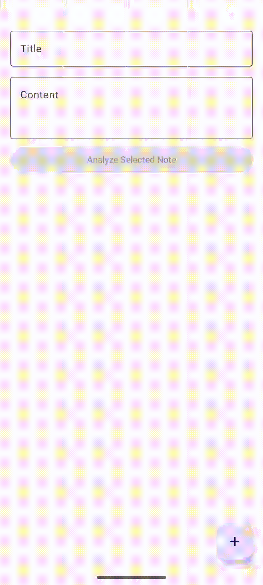

# 🤖 SmartMeetingAI

An intelligent Android application for automatic meeting note-taking with AI-powered summarization and action item extraction. Capture meetings effortlessly using speech recognition and let AI transform them into actionable insights.

<div align="center">
  
  
  
  
</div>

---

## 🎥 Demo



---

## ✨ Features

- 🎤 **Real-time Speech Recognition** - Transcribe meetings directly from your microphone
- 🧠 **AI-Powered Summarization** - Automatically generate concise meeting summaries
- ✅ **Action Item Extraction** - Extract and track action items from meetings
- 💾 **Local Storage** - All notes stored locally on your device with Room database
- 📱 **Modern UI** - Built with Jetpack Compose for smooth, responsive interface
- 🏗️ **Clean Architecture** - MVVM pattern with dependency injection (Hilt)
- 🔒 **On-Device AI** - Uses Gemini Nano for privacy-first AI processing
- 🌓 **Dark Mode Support** - Beautiful Material Design 3 theming

---

## 🛠️ Tech Stack

### Architecture & Patterns
- **MVVM** (Model-View-ViewModel) architecture
- **Clean Architecture** principles
- **Repository Pattern** for data access

### UI Framework
- **Jetpack Compose** - Modern declarative UI toolkit
- **Material Design 3** - Latest Material Design system

### Dependencies & Libraries
- **Kotlin** (17 JDK target) - Modern Android development language
- **Hilt** - Dependency injection framework
- **Room** - Local SQLite database
- **Gemini Nano** - On-device language model via ML Kit
- **Android Speech Recognition** - Native speech-to-text capabilities
- **Coroutines** - Asynchronous programming

### Build System
- **Gradle** (Kotlin DSL)
- **AGP 8.5.2** - Latest Android Gradle Plugin

---

## 📋 Project Structure

```
app/src/
├── main/
│   ├── java/com/example/smartmeetingai/
│   │   ├── ai/                    # AI processing logic
│   │   │   ├── ActionItemExtractor.kt
│   │   │   ├── LocalAiManager.kt
│   │   │   └── gemini/
│   │   │       └── GeminiNanoEngine.kt
│   │   ├── data/                  # Data layer
│   │   │   ├── local/             # Local storage (Room)
│   │   │   └── repository/        # Repository pattern
│   │   ├── di/                    # Dependency injection
│   │   │   ├── DatabaseModule.kt
│   │   │   └── RepositoryModule.kt
│   │   ├── speech/                # Speech recognition
│   │   │   ├── SpeechManager.kt
│   │   │   └── SpeechRecognizer.kt
│   │   ├── ui/                    # UI layer
│   │   │   ├── home/              # Home screen
│   │   │   ├── navigation/        # Navigation setup
│   │   │   └── theme/             # Material Design 3 theme
│   │   ├── viewmodel/             # ViewModel layer
│   │   ├── MainActivity.kt
│   │   └── SmartMeetingAIApplication.kt
│   ├── AndroidManifest.xml        # App manifest
│   └── res/                       # Resources
├── test/                          # Unit tests
└── androidTest/                   # Instrumented tests
```

---

## 🚀 Getting Started

### Prerequisites
- Android Studio Iguana or later
- Android SDK 35 (compileSdk)
- Minimum Android API Level 26 (minSdk)
- Java Development Kit (JDK) 17+
- Gradle 8.5+

### Installation

1. **Clone the repository**
   ```bash
   git clone https://github.com/adiget/AI-note-taking-app.git
   cd AI-note-taking-app
   ```

2. **Open in Android Studio**
   - File → Open → Select the project directory
   - Let Gradle sync automatically

3. **Install TensorFlow Lite Model**
   - The project includes `bert_model.tflite.zip`
   - Extract it to the appropriate models directory if needed
   - The model is used for on-device AI processing

4. **Configure Permissions**
   - The app requires microphone permissions for speech recognition
   - These are declared in `AndroidManifest.xml` and requested at runtime

5. **Build & Run**
   ```bash
   ./gradlew build
   ```
   - Or directly run in Android Studio with the green play button (minimum API 26)

### Setting up the Gradle Build

The project uses Gradle wrapper. On macOS/Linux:
```bash
chmod +x gradlew
./gradlew build
```

On Windows:
```bash
gradlew.bat build
```

---

## 📚 Usage

### Taking a Meeting Note
1. Open the SmartMeetingAI app
2. Navigate to Home screen
3. Tap the microphone button to start recording
4. Speak naturally - the app transcribes in real-time
5. Tap stop when finished
6. The AI automatically:
   - Summarizes the meeting
   - Extracts action items
   - Saves the note locally

### Viewing & Managing Notes
- Browse all notes from the home screen
- Tap any note to view full details
- Edit notes and action items as needed
- Delete notes you no longer need

---

## 🔧 Development

### Project Dependencies

**Key dependencies** (see `build.gradle.kts` for full list):
- Jetpack Compose
- Hilt for DI
- Room for local database
- ML Kit Gemini Nano
- Google Play Services for speech recognition
- Kotlin coroutines & flows

### Building Locally

```bash
# Build debug APK
./gradlew assembleDebug

# Build release APK (requires signing config)
./gradlew assembleRelease

# Run tests
./gradlew test

# Run instrumented tests on device
./gradlew connectedAndroidTest
```

### Adding Dependencies

Edit `app/build.gradle.kts` and add under `dependencies { }` block:
```kotlin
dependencies {
    implementation("com.example:library:1.0.0")
}
```

Then sync Gradle.

---

## 🏗️ Architecture Overview

### MVVM Pattern
- **View**: Jetpack Compose UI screens
- **ViewModel**: State management and business logic (HomeViewModel)
- **Model**: Data classes and repositories

### Data Flow
```
UI (Compose) 
    ↓
ViewModel (HomeViewModel)
    ↓
Repository (RepositoryModule)
    ↓
Local DB (Room) / Remote Services
```

### Dependency Injection
Hilt modules configure app dependencies:
- `DatabaseModule` - Room database setup
- `RepositoryModule` - Repository dependencies

---

## 🔐 Permissions

The app requires the following permissions (declared in `AndroidManifest.xml`):
- `RECORD_AUDIO` - For speech recognition
- `INTERNET` (if using cloud services)
- `READ_EXTERNAL_STORAGE` / `WRITE_EXTERNAL_STORAGE` (if saving files)

---

## 🧪 Testing

The project includes test directories:
- `src/test/` - Unit tests (run on JVM)
- `src/androidTest/` - Instrumented tests (run on Android device/emulator)

```bash
# Run all unit tests
./gradlew test

# Run instrumented tests
./gradlew connectedAndroidTest

# Run specific test class
./gradlew test --tests "com.example.smartmeetingai.*"
```

---

## 📦 Building for Release

1. **Generate signing key** (if not already done)
   ```bash
   keytool -genkey -v -keystore my-release-key.jks -keyalg RSA -keysize 2048 -validity 10000 -alias smartmeetingai
   ```

2. **Configure signing in `app/build.gradle.kts`**
   ```kotlin
   signingConfigs {
       release {
           storeFile = file("path/to/my-release-key.jks")
           storePassword = "..."
           keyAlias = "smartmeetingai"
           keyPassword = "..."
       }
   }
   ```

3. **Build release APK**
   ```bash
   ./gradlew assembleRelease
   ```

---

## 🤝 Contributing

Contributions are welcome! Here's how to get started:

1. Fork the repository
2. Create a feature branch (`git checkout -b feature/amazing-feature`)
3. Commit your changes (`git commit -m 'Add amazing feature'`)
4. Push to the branch (`git push origin feature/amazing-feature`)
5. Open a Pull Request

### Code Style
- Follow Kotlin style guide
- Use meaningful variable names
- Add comments for complex logic
- Keep functions focused and small

---

## 🐛 Troubleshooting

### Gradle Sync Issues
- Check that `local.properties` exists and points to Android SDK
- Try `./gradlew clean` then rebuild
- Invalidate caches in Android Studio: File → Invalidate Caches

### Runtime Crashes
- Ensure microphone permission is granted
- Check device API level is 26+
- Review logcat for detailed error messages

### ML Model Not Found
- Verify `bert_model.tflite.zip` is in project
- Extract if needed to `app/src/main/ml/`

---

## 📄 License

This project is licensed under the MIT License - see the LICENSE file for details.

---

## 👨‍💻 Author

**Adiget** - [GitHub Profile](https://github.com/adiget)

---

## 🙏 Acknowledgments

- Built with **Jetpack Compose** for modern Android development
- Powered by **Google Gemini Nano** for on-device AI
- Architecture inspired by Android Architecture Components best practices
- Material Design 3 for beautiful, accessible UI

---

## 📞 Support

If you encounter any issues or have questions:
1. Check the [Troubleshooting](#-troubleshooting) section
2. Review the [Architecture Overview](#-architecture-overview)
3. Open an issue on GitHub

---

**Made with ❤️ for smarter meetings**
